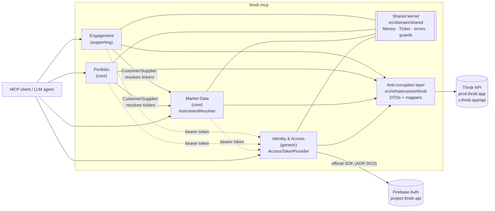

# thndr-mcp documentation

thndr-mcp is a community, **unofficial**, read-only (with respect to money) MCP server for the
[Thndr](https://thndr.app) broker on the Egyptian Exchange (EGX). It is built with Domain-Driven Design and a
hexagonal architecture ([ADR 0003](adr/0003-ddd-hexagonal-architecture.md)).

## Architecture Decision Records — [`adr/`](adr/README.md)

| ADR | Summary |
| --- | --- |
| [0001](adr/0001-record-architecture-decisions.md) | Decisions are recorded as numbered, immutable ADRs. |
| [0002](adr/0002-typescript-on-nodejs.md) | Strict TypeScript on Node.js ≥ 20, MCP SDK + zod, Vitest, Biome. |
| [0003](adr/0003-ddd-hexagonal-architecture.md) | DDD layers (domain / application / infrastructure / interface) and the four bounded contexts. |
| [0004](adr/0004-reverse-engineer-thndrx-web-client.md) | The ThndrX web client (`x.thndr.app`) is the source of truth for the API. |
| [0005](adr/0005-testing-strategy.md) | No real network in tests; ≥ 95 % coverage gate. |
| [0006](adr/0006-trading-safety.md) | Read-only scope: no order entry, no fund movement. |
| [0007](adr/0007-authentication-and-session.md) | Email OTP + phone approval login, token lifecycle, session file. |
| [0008](adr/0008-ibkr-mcp-as-reference.md) | Tool names mirror the Interactive Brokers MCP where possible. |
| [0009](adr/0009-stdio-transport-and-logging.md) | stdio transport; logs go to stderr, redacted. |
| [0010](adr/0010-prefer-official-sdks.md) | Official SDKs (Firebase Auth, MCP) over hand-rolled HTTP. |

## Domains — [`domains/`](domains/README.md)

| Document | Summary |
| --- | --- |
| [Strategic design](domains/README.md) | Subdomains, bounded contexts, shared kernel, anti-corruption layer, layering rules. |
| [Identity & Access](domains/identity-and-access.md) | Login flow, device approval, tokens and sessions. |
| [Market Data](domains/market-data.md) | Instruments, quotes, candles, order book, tape, market session, screening. |
| [Portfolio](domains/portfolio.md) | Cash, positions, orders (history), returns, trading journal, account activity. |
| [Engagement](domains/engagement.md) | Watchlists, price alerts, notifications. |

## Use cases — [`use-cases/`](use-cases/README.md)

| Document | Summary |
| --- | --- |
| [Tool catalogue](use-cases/README.md) | Every MCP tool → use case → bounded context → Thndr endpoint → IBKR equivalent. |
| [Identity & Access](use-cases/identity-and-access.md) | `auth_status`, the 3-step login, re-approval, session import, logout. |
| [Market Data](use-cases/market-data.md) | Search, details, snapshot, history, depth, tape, market status, screener. |
| [Portfolio](use-cases/portfolio.md) | Account summary, positions, orders, returns, journal, metrics, activity. |
| [Engagement](use-cases/engagement.md) | Watchlist, price-alert and notification tools. |

## Reverse-engineered Thndr API — [`api/`](api/)

| Document | Summary |
| --- | --- |
| [auth.md](api/auth.md) | Firebase identity, device-approval 2FA, full-access token exchange, refresh and logout. |
| [market-data.md](api/market-data.md) | Assets, marketwatch, charts/candles, market depth, trades book, watchlists, screeners, price alerts, notifications. |
| [trading-and-portfolio.md](api/trading-and-portfolio.md) | Wallet and portfolio, positions, orders, realized returns, trading journal, account activity, market status. |
| [endpoints.generated.md](api/endpoints.generated.md) | Generated list of base URLs and paths found in the ThndrX bundle (`npm run sync:api`); do not edit. |

## Context map

- **Portfolio** and **Engagement** are downstream of **Market Data**: they use its `InstrumentResolver` to turn a
  ticker (`COMI`) or asset id into an instrument.
- Every Thndr HTTP call obtains its bearer token through Identity's `AccessTokenProvider` port
  (implemented by `SessionTokenProvider`).
- Thndr's wire formats never cross the anti-corruption layer; the domain only sees its own model.
