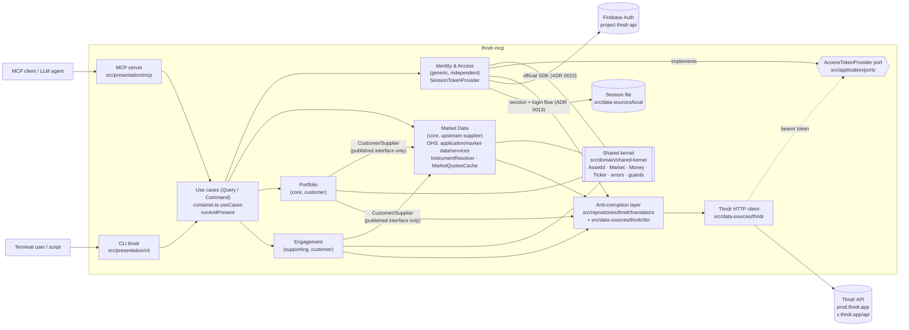

# thndr-mcp documentation

thndr-mcp is a community, **unofficial**, read-only (with respect to money) MCP server **and CLI** for the
[Thndr](https://thndr.app) broker on the Egyptian Exchange (EGX). It is built with Domain-Driven Design
([ADR 0003](adr/0003-ddd-hexagonal-architecture.md)) in five Clean Architecture layers — domain, application,
repositories, data sources, presentation — with Command–Query Separation and an enforced context map
([ADR 0015](adr/0015-five-layer-clean-architecture-cqs-and-context-map.md), superseding the layout of
[ADR 0011](adr/0011-ddd-layered-architecture.md)). Both delivery mechanisms — the `thndr-mcp` MCP server and the
`thndr` CLI — are generated from the same list of use-case classes (`Query` / `Command`) and run them through one
shared path ([ADR 0012](adr/0012-use-case-classes-shared-by-mcp-and-cli.md)), sharing one session file
([ADR 0013](adr/0013-persisted-login-flow-and-shared-session.md)).

## Architecture Decision Records — [`adr/`](adr/README.md)

| ADR | Summary |
| --- | --- |
| [0001](adr/0001-record-architecture-decisions.md) | Decisions are recorded as numbered, immutable ADRs. |
| [0002](adr/0002-typescript-on-nodejs.md) | Strict TypeScript on Node.js ≥ 20, MCP SDK + zod, Vitest, Biome; build refined by 0014. |
| [0003](adr/0003-ddd-hexagonal-architecture.md) | DDD layers and the four bounded contexts; layout refined by 0011 then 0015, use-case shape by 0012. |
| [0004](adr/0004-reverse-engineer-thndrx-web-client.md) | The ThndrX web client (`x.thndr.app`) is the source of truth for the API. |
| [0005](adr/0005-testing-strategy.md) | No real network in tests; ≥ 95 % coverage gate. |
| [0006](adr/0006-trading-safety.md) | Read-only scope: no order entry, no fund movement. |
| [0007](adr/0007-authentication-and-session.md) | Email OTP + phone approval login, token lifecycle, session file. |
| [0008](adr/0008-ibkr-mcp-as-reference.md) | Tool names mirror the Interactive Brokers MCP where possible. |
| [0009](adr/0009-stdio-transport-and-logging.md) | stdio transport; logs go to stderr, redacted. |
| [0010](adr/0010-prefer-official-sdks.md) | Official SDKs (Firebase Auth, MCP) over hand-rolled HTTP. |
| [0011](adr/0011-ddd-layered-architecture.md) | *Superseded by 0015.* DDD layered layout with repositories and data sources grouped under `infrastructure/`. |
| [0012](adr/0012-use-case-classes-shared-by-mcp-and-cli.md) | Use cases are self-describing `Query` / `Command` classes listed by `container.ts`; MCP and CLI are generated from them and share `runAndPresent`; camelCase arguments, kebab-case CLI commands and flags. |
| [0013](adr/0013-persisted-login-flow-and-shared-session.md) | `LoginFlowRepository` persists the pending login; uncached session file shared by MCP and CLI. |
| [0014](adr/0014-extensionless-imports-and-bundled-build.md) | Extensionless imports; `tsc` only typechecks; tsup bundles `dist/thndr-mcp.js` and `dist/thndr.js`. |
| [0015](adr/0015-five-layer-clean-architecture-cqs-and-context-map.md) | Five layers (`domain/`, `application/`, `repositories/`, `data-sources/`, `presentation/`); CQS — commands return flat receipts, never read models; context map (Market Data = upstream supplier with an Open Host Service, Portfolio and Engagement = customers, Identity independent); all enforced by `src/__tests__/architecture.test.ts`. |
| [0016](adr/0016-login-on-demand-via-mcp-elicitation.md) | Login on demand: when a tool needs a session and the client supports MCP elicitation, the server asks for email, code and phone approval itself (shared guided login with `thndr login`), then retries the tool. |

## Domains — [`domains/`](domains/README.md)

| Document | Summary |
| --- | --- |
| [Strategic design](domains/README.md) | Subdomains, bounded contexts and context map, the five layers and dependency rule, CQS, shared kernel, anti-corruption layer, presentation (presenters, MCP, CLI). |
| [Identity & Access](domains/identity-and-access.md) | Login flow (persisted), device approval, tokens, the session shared by MCP and CLI. |
| [Market Data](domains/market-data.md) | Instruments, quotes, candles, order book, tape, market session, screening. |
| [Portfolio](domains/portfolio.md) | Cash, positions, orders (history), returns, trading journal, account activity. |
| [Engagement](domains/engagement.md) | Watchlists, price alerts, notifications. |

## Use cases — [`use-cases/`](use-cases/README.md)

| Document | Summary |
| --- | --- |
| [Use-case index](use-cases/README.md) | Every use case: MCP tool + CLI command → use-case class → bounded context → Thndr endpoint → IBKR equivalent. |
| [Identity & Access](use-cases/identity-and-access.md) | `auth_status`, the 3-step login (and guided `thndr login`), re-approval, session import, logout. |
| [Market Data](use-cases/market-data.md) | Search, details, snapshot, history, depth, tape, market status, screener. |
| [Portfolio](use-cases/portfolio.md) | Account summary, positions, orders, returns, journal, metrics, activity. |
| [Engagement](use-cases/engagement.md) | Watchlist, price-alert and notification use cases. |

## Reverse-engineered Thndr API — [`api/`](api/)

| Document | Summary |
| --- | --- |
| [auth.md](api/auth.md) | Firebase identity, device-approval 2FA, full-access token exchange, refresh and logout. |
| [market-data.md](api/market-data.md) | Assets, marketwatch, charts/candles, market depth, trades book, watchlists, screeners, price alerts, notifications. |
| [trading-and-portfolio.md](api/trading-and-portfolio.md) | Wallet and portfolio, positions, orders, realized returns, trading journal, account activity, market status. |
| [endpoints.generated.md](api/endpoints.generated.md) | Generated list of base URLs and paths found in the ThndrX bundle (`npm run sync:api`); do not edit. |

## Context map

See [ADR 0015](adr/0015-five-layer-clean-architecture-cqs-and-context-map.md) and [domains/README.md](domains/README.md#context-map-adr-0015).
The rules are enforced by `src/__tests__/architecture.test.ts`.

| Context | Role | May depend on |
| --- | --- | --- |
| Identity & Access | Generic subdomain, independent | no other context |
| Market Data | Core, upstream **supplier**; **Open Host Service** = `application/market-data/services/*` + its domain types (published language) | no other context |
| Portfolio | Core, **customer** of Market Data | Market Data's published interface |
| Engagement | Supporting, **customer** of Market Data | Market Data's published interface |

- **Portfolio** and **Engagement** are customers of **Market Data**: they use its `InstrumentResolver` (Engagement
  also `MarketQuotesCache`) to turn a ticker (`COMI`) or asset id into an instrument. They may import only Market
  Data's domain types and `application/market-data/services/*`.
- **Nothing depends on Portfolio or Engagement**; they never depend on each other or on Identity.
- The **shared kernel** (`AssetId`, `Market`, `Money`, `Ticker`, errors, guards) is used by every context and depends
  on nothing.
- **Identity** is reached only through a port: every Thndr HTTP call obtains its bearer token from the
  `AccessTokenProvider` application port, implemented by Identity's `SessionTokenProvider`.
- Thndr's wire formats never cross the anti-corruption layer; the domain only sees its own model.
- **CQS**: queries return data; commands return a flat receipt (ids, flags, a message). To see the new state after a
  command, call the matching query (e.g. `create_watchlist` → `get_watchlist`).
- The MCP server and the CLI are thin adapters over the same `useCases` list built by `src/container.ts`: every use
  case validates its own input in `UseCase.run`, and both apps execute and present it through `runAndPresent`, so the
  two cannot drift. They also share the session file, so logging in through
  either one logs in both.
