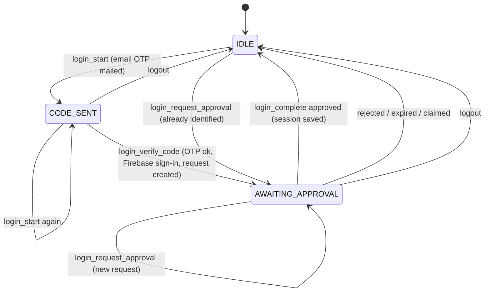

# Identity & Access (generic subdomain)

Obtains and keeps an authenticated ThndrX session on behalf of the account holder, so other contexts can call
Thndr with a valid bearer token. Based on [docs/api/auth.md](../api/auth.md),
[ADR 0007](../adr/0007-authentication-and-session.md) and [ADR 0010](../adr/0010-prefer-official-sdks.md).

Code: `src/domain/identity/`, `src/application/identity/`, `src/application/ports/identity.ts`,
`src/application/ports/access-token-provider.ts`. Use cases: [use-cases/identity-and-access.md](../use-cases/identity-and-access.md).

## Ubiquitous language

| Term | Meaning |
| --- | --- |
| **Firebase identity** | Stage 1 of login. The user is signed in to Firebase project `thndr-api`; we hold a Firebase **ID token**. Obtained here via email OTP → Thndr returns a Firebase *custom token* → `signInWithCustomToken`. Persisted, so it survives restarts. |
| **Verification id** | Id returned by Thndr when it mails the 6-digit OTP; needed to verify the code. |
| **Device approval request** | Stage 2 (2FA). A *token request* created with the Firebase ID token that the user must approve **in the logged-in Thndr mobile app**. Has an `id`, a `secret` (`request_secret`) and a `humanId`. |
| **Human id** | Short code shown to the user so they can match the request on their phone. Part of the deep link. |
| **Deep link** | `thndr://goToRoute?routeName=HUMAN_ID&human_id=…&user_agent=…&requestId=…` — the same payload ThndrX renders as a QR code. |
| **Approval status** | `pending`, `approved`, `claimed` (already exchanged), `rejected` (also `declined`/`denied`), `expired`, `unknown`. |
| **Full-access token** (`AccessToken`) | The ~15-minute JWT sent as `Authorization: Bearer`. |
| **Refresh credential** | The httpOnly cookie(s) set by `x.thndr.app/api/auth/login`. The cookie name is invisible to ThndrX JS, so **all** cookies are kept and replayed. Client-side hint: ~6 h. |
| **Session** (`ThndrSession`) | Refresh credential + optional cached access token + `establishedAt`. "Logged in" means a session exists and its refresh credential has not expired. |
| **Login flow** | The in-process state machine of an interactive login (`IDLE` → `CODE_SENT` → `AWAITING_APPROVAL` → `IDLE`). |
| **Re-approval** | Creating a new device approval request for an already identified user (no OTP), used when the session expired. |
| **Session import** | Fallback: build a session from the `Cookie` header of a logged-in `x.thndr.app` browser (for Google/Apple-only accounts). |

## Model

All are immutable (`Object.freeze`) and validate in their factory.

### `Email` (value object) — `email.ts`
- Trimmed, lower-cased; must match `^[^\s@]+@[^\s@]+\.[^\s@]+$` else `VALIDATION_ERROR`.
- `masked()` → `a***@example.com`, the only form shown in tool output.

### `DeviceApprovalRequest` (value object) — `device-approval.ts`
- Fields: `id`, `secret`, `humanId`, `createdAt`.
- Invariants: `id` and `secret` non-empty; `humanId` may be empty.
- `deepLink(userAgent)` builds the deep link above. `parseApprovalStatus(raw)` normalises upstream statuses.

### `AccessToken` (value object) — `access-token.ts`
- Fields: `value`, `expiresAt`. Invariants: non-empty value, valid date.
- `status(now)` and `isUsable(now)` (true unless `EXPIRED`). See [token lifecycle](#token-lifecycle).

### `RefreshCredential` (value object) — `refresh-credential.ts`
- Fields: `cookies` (name → value), `expiresAt` (nullable).
- Invariants: at least one named cookie; `expiresAt`, when present, is a valid date.
- `fromCookieHeader("a=1; b=2")`, `merge(updates)` (rotated cookies win), `toCookieHeader()`, `isExpired(now)`
  (never expired when `expiresAt` is null).

### `ThndrSession` (aggregate root) — `thndr-session.ts`
- Holds `refresh`, `accessToken | null`, `establishedAt`.
- Created by `establish(...)` (new login) or `restore(...)` (from disk); changed only by returning new instances:
  `withAccessToken(token, refresh?)`, `withoutAccessToken()`.
- `usableAccessToken(now)` returns the cached token only when its status is `VALID`.
- Persisted as a whole through `SessionRepository`.

### `LoginFlow` (aggregate, process state) — `login-flow.ts`
- Fields: `stage`, `email`, `verificationId`, `approval`.
- Guards: `requireCodeSent()` throws `LOGIN_NOT_STARTED`; `requireAwaitingApproval()` throws
  `NO_PENDING_APPROVAL` (both `BusinessRuleViolation`).
- Held in memory by `LoginFlowHolder` (application); it is **not** persisted.

`login_start` and `login_request_approval` may be called from any stage; they overwrite the current flow.

## Token lifecycle

Mirrors ThndrX (`docs/api/auth.md` §2.4, §3):

| Status | Condition | What `SessionTokenProvider.getAccessToken()` does |
| --- | --- | --- |
| `VALID` | more than 180 s left | returns the cached token |
| `ABOUT_TO_EXPIRE` | 0 < remaining ≤ 180 s (`ACCESS_TOKEN_REFRESH_WINDOW_MS`) | returns the cached token and refreshes **in the background** |
| `EXPIRED` | remaining ≤ 0 (or no cached token) | refreshes **blocking**, then returns the new token |

- Refresh = `POST x.thndr.app/api/auth/refresh` with the refresh cookies. Rotated cookies are merged into the
  credential and the session is saved.
- Expiry of a new token: `auth_token_expires_at`, else the JWT `exp`, else 15 min (`DEFAULT_ACCESS_TOKEN_TTL_MS`).
- Refreshes are **single-flighted**: concurrent callers share one in-flight refresh.
- On 401/403 from any Thndr call, the HTTP client calls `invalidate()` (forces the next call to refresh) and
  retries once; a second 401 → `NOT_AUTHENTICATED`.
- Refresh rejected with `INVALID_REFRESH_TOKEN | MISSING_REFRESH_TOKEN | EXPIRED_REFRESH_TOKEN` or 401, or a
  locally expired refresh credential → the session is cleared and `SESSION_EXPIRED` is raised. The Firebase
  identity is kept, so re-approval needs no OTP.
- No session at all → `NOT_AUTHENTICATED`.

## Ports and adapters

| Port (`src/application/ports/`) | Methods | Adapter |
| --- | --- | --- |
| `ThndrAuthGateway` | `sendEmailCode`, `verifyEmailCode`, `createApprovalRequest`, `getApprovalStatus`, `exchangeApproval`, `refreshAccess`, `logout` | `HttpThndrAuthGateway` (`infrastructure/thndr/auth-gateway.ts`); requests the ThndrX web scope list, platform `thndrx_web` |
| `IdentityProvider` | `signInWithCustomToken`, `getIdToken`, `signOut` | `FirebaseIdentityProvider` (`infrastructure/firebase/`), official `@firebase/auth` SDK with file-backed persistence |
| `SessionRepository` | `load`, `save`, `clear` | `FileSessionRepository` (`infrastructure/persistence/`): one JSON file, `$THNDR_SESSION_FILE` or `~/.config/thndr-mcp/session.json`, mode `0600` in a `0700` dir, atomic writes |
| `AccessTokenProvider` (consumed by all contexts) | `getAccessToken`, `invalidate` | `SessionTokenProvider` (`application/identity/session-token-provider.ts`) |
| `Clock`, `Logger` | `now()`; `debug/info/warn/error` | `systemClock`; redacting stderr logger |

The session file holds Firebase persistence entries plus `{cookies, refreshExpiresAt, accessToken,
accessTokenExpiresAt, establishedAt}`. It is git-ignored and never logged.

## Rules

- Never auto-approve or bypass the device approval; the deep link is shown to the user (ADR 0007).
- Never print tokens, cookies or the session file. Emails are shown masked.
- The user must have the Thndr mobile app logged in to complete a login.
