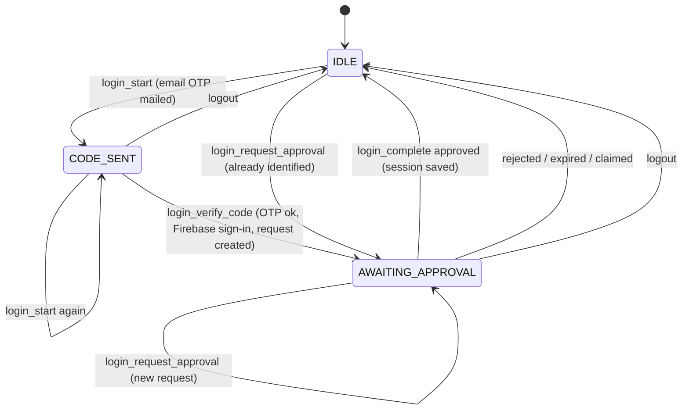

# Identity & Access (generic subdomain)

Obtains and keeps an authenticated ThndrX session on behalf of the account holder, so other contexts can call
Thndr with a valid bearer token. Based on [docs/api/auth.md](../api/auth.md),
[ADR 0007](../adr/0007-authentication-and-session.md) and [ADR 0010](../adr/0010-prefer-official-sdks.md).

Code: `src/domain/identity/` (repository interfaces in `repository.ts`), `src/application/identity/`,
`src/application/ports/identity.ts`, `src/application/ports/access-token-provider.ts`; use-case classes in
`src/application/identity/queries/` and `commands/`, application services `SessionTokenProvider` and
`DeviceApprovalRequester` in `src/application/identity/services/`.

**Context map ([ADR 0015](../adr/0015-five-layer-clean-architecture-cqs-and-context-map.md)):** Identity & Access is a generic subdomain and **independent**: it depends on no other
context, and no context's domain or application code imports it. The other contexts reach it only indirectly: the
Thndr HTTP client (`src/data-sources/thndr/http-client.ts`) gets its bearer token from the `AccessTokenProvider`
application port, which `SessionTokenProvider` implements. The login commands return flat CQS receipts (ids, flags,
a message); `auth_status` is the query for the resulting state. `VerifyLoginCode` and `RequestDeviceApproval` share
the `DeviceApprovalRequester` service rather than calling each other.
Use cases: [use-cases/identity-and-access.md](../use-cases/identity-and-access.md).

## Ubiquitous language

| Term | Meaning |
| --- | --- |
| **Firebase identity** | Stage 1 of login. The user is signed in to Firebase project `thndr-api`; we hold a Firebase **ID token**. Obtained here via email OTP → Thndr returns a Firebase *custom token* → `signInWithCustomToken`. Persisted, so it survives restarts. |
| **Verification id** | Id returned by Thndr when it mails the 6-digit OTP; needed to verify the code. |
| **Device approval request** | Stage 2 (2FA). A *token request* created with the Firebase ID token that the user must approve **in the logged-in Thndr mobile app**. Has an `id`, a `secret` (`request_secret`) and a `humanId`. |
| **Human id** | Short code shown to the user so they can match the request on their phone. Part of the deep link. |
| **Deep link** | `thndr://goToRoute?routeName=HUMAN_ID&human_id=…&user_agent=…&requestId=…` — the same payload ThndrX renders as a QR code. |
| **Approval status** | `pending`, `approved`, `claimed` (already exchanged), `rejected` (also `declined`/`denied`), `expired`, `unknown`. |
| **Full-access token** (`AccessToken`) | The ~15-minute JWT sent as `Authorization: Bearer`. |
| **Refresh credential** | The httpOnly cookie(s) set by `x.thndr.app/api/auth/login`. The cookie name is invisible to ThndrX JS, so **all** cookies are kept and replayed. Client-side hint: ~6 h. |
| **Session** (`ThndrSession`) | Refresh credential + optional cached access token + `establishedAt`. "Logged in" means a session exists and its refresh credential has not expired. |
| **Login flow** | The state machine of an interactive login (`IDLE` → `CODE_SENT` → `AWAITING_APPROVAL` → `IDLE`). Persisted between steps, so each step may run in a different process. |
| **Re-approval** | Creating a new device approval request for an already identified user (no OTP), used when the session expired. |
| **Session import** | Fallback: build a session from the `Cookie` header of a logged-in `x.thndr.app` browser (for Google/Apple-only accounts). |

## Model

All are immutable (`Object.freeze`) and validate in their factory.

### `Email` (value object) — `email.ts`
- Trimmed, lower-cased; must match `^[^\s@]+@[^\s@]+\.[^\s@]+$` else `VALIDATION_ERROR`.
- `masked()` → `a***@example.com`, the only form shown in tool output.

### `DeviceApprovalRequest` (value object) — `device-approval.ts`
- Fields: `id`, `secret`, `humanId`, `createdAt`.
- Invariants: `id` and `secret` non-empty; `humanId` may be empty.
- `deepLink(userAgent)` builds the deep link above. `parseApprovalStatus(raw)` normalises upstream statuses.

### `AccessToken` (value object) — `access-token.ts`
- Fields: `value`, `expiresAt`. Invariants: non-empty value, valid date.
- `status(now)` and `isUsable(now)` (true unless `EXPIRED`). See [token lifecycle](#token-lifecycle).

### `RefreshCredential` (value object) — `refresh-credential.ts`
- Fields: `cookies` (name → value), `expiresAt` (nullable).
- Invariants: at least one named cookie; `expiresAt`, when present, is a valid date.
- `fromCookieHeader("a=1; b=2")`, `merge(updates)` (rotated cookies win), `toCookieHeader()`, `isExpired(now)`
  (never expired when `expiresAt` is null).

### `ThndrSession` (aggregate root) — `thndr-session.ts`
- Holds `refresh`, `accessToken | null`, `establishedAt`.
- Created by `establish(...)` (new login) or `restore(...)` (from disk); changed only by returning new instances:
  `withAccessToken(token, refresh?)`, `withoutAccessToken()`.
- `usableAccessToken(now)` returns the cached token only when its status is `VALID`.
- Persisted as a whole through `SessionRepository`.

### `LoginFlow` (aggregate) — `login-flow.ts`
- Fields: `stage`, `email`, `verificationId`, `approval`.
- Guards: `requireCodeSent()` throws `LOGIN_NOT_STARTED`; `requireAwaitingApproval()` throws
  `NO_PENDING_APPROVAL` (both `BusinessRuleViolation`).
- Persisted through the domain repository `LoginFlowRepository` (`load()` → `LoginFlow`, `idle()` when nothing is
  stored; `save(flow)`), [ADR 0013](../adr/0013-persisted-login-flow-and-shared-session.md). Every login use case
  loads the flow, applies one transition and saves it, so a login started with `thndr login-start` can be finished
  with `thndr login-complete` (separate processes), or survive an MCP server restart.
- Production storage is the `loginFlow` section of the session file: `stage`, `email`, `verificationId` and the
  pending `approval` (`id`, `secret`, `humanId`, `createdAt`). `IDLE` is stored as `null`; an unreadable record is
  treated as `IDLE`. The approval `secret` is short-lived and protected like the refresh cookie (file mode `0600`).

`login_start` and `login_request_approval` may be called from any stage; they overwrite the current flow.

## Token lifecycle

Mirrors ThndrX (`docs/api/auth.md` §2.4, §3):

| Status | Condition | What `SessionTokenProvider.getAccessToken()` does |
| --- | --- | --- |
| `VALID` | more than 180 s left | returns the cached token |
| `ABOUT_TO_EXPIRE` | 0 < remaining ≤ 180 s (`ACCESS_TOKEN_REFRESH_WINDOW_MS`) | returns the cached token and refreshes **in the background** |
| `EXPIRED` | remaining ≤ 0 (or no cached token) | refreshes **blocking**, then returns the new token |

- Refresh = `POST x.thndr.app/api/auth/refresh` with the refresh cookies. Rotated cookies are merged into the
  credential and the session is saved.
- Expiry of a new token: `auth_token_expires_at`, else the JWT `exp`, else 15 min (`DEFAULT_ACCESS_TOKEN_TTL_MS`).
- Refreshes are **single-flighted**: concurrent callers share one in-flight refresh.
- On 401/403 from any Thndr call, the HTTP client calls `invalidate()` (forces the next call to refresh) and
  retries once; a second 401 → `NOT_AUTHENTICATED`.
- Refresh rejected with `INVALID_REFRESH_TOKEN | MISSING_REFRESH_TOKEN | EXPIRED_REFRESH_TOKEN` or 401, or a
  locally expired refresh credential → the session is cleared and `SESSION_EXPIRED` is raised. The Firebase
  identity is kept, so re-approval needs no OTP.
- No session at all → `NOT_AUTHENTICATED`.

## Repositories, ports and adapters

Repository interfaces belong to the domain (`src/domain/identity/repository.ts`); technical services the domain
does not care about are application ports (`src/application/ports/`), [ADR 0015](../adr/0015-five-layer-clean-architecture-cqs-and-context-map.md).

| Contract | Kind | Methods | Implementation |
| --- | --- | --- | --- |
| `SessionRepository` | domain repository | `load`, `save`, `clear` | `FileSessionRepository` (`repositories/local/session-repository.ts`), `thndr` section of the session file |
| `LoginFlowRepository` | domain repository | `load`, `save` | `FileLoginFlowRepository` (`repositories/local/login-flow-repository.ts`), `loginFlow` section of the session file; `InMemoryLoginFlowRepository` (`repositories/memory/login-flow-repository.ts`) for tests |
| `ThndrAuthGateway` | application port (`ports/identity.ts`) | `sendEmailCode`, `verifyEmailCode`, `createApprovalRequest`, `getApprovalStatus`, `exchangeApproval`, `refreshAccess`, `logout` | `HttpThndrAuthGateway` (`repositories/thndr/auth-gateway.ts`); requests the ThndrX web scope list, platform `thndrx_web` |
| `IdentityProvider` | application port (`ports/identity.ts`) | `signInWithCustomToken`, `getIdToken`, `signOut` | `FirebaseIdentityProvider` (`data-sources/firebase/`), official `@firebase/auth` SDK with file-backed persistence (`firebase` section of the session file) |
| `AccessTokenProvider` (consumed by all contexts) | application port | `getAccessToken`, `invalidate` | `SessionTokenProvider` (`application/identity/services/session-token-provider.ts`) |
| `Clock`, `Logger` | application ports | `now()`; `debug/info/warn/error` | `systemClock`; redacting stderr logger (`data-sources/logging/`) |

### The session file (shared by MCP and CLI)

All three sections live in one JSON document managed by `SessionFile`
(`src/data-sources/local/session-file.ts`): `$THNDR_SESSION_FILE`, else
`$XDG_CONFIG_HOME/thndr-mcp/session.json` (default `~/.config/thndr-mcp/session.json`), mode `0600` in a `0700`
directory.

| Section | Contents |
| --- | --- |
| `firebase` | Firebase Auth persistence entries (ADR 0010). |
| `thndr` | `{cookies, refreshExpiresAt, accessToken, accessTokenExpiresAt, establishedAt}` — the `ThndrSession`. |
| `loginFlow` | The pending `LoginFlow`, or `null` (ADR 0013). |

- **No caching** ([ADR 0013](../adr/0013-persisted-login-flow-and-shared-session.md)): every read goes to disk, and
  every write is a read-modify-write that is serialised within the process and atomic on disk (temp file + rename).
- The MCP server (`thndr-mcp`) and the CLI (`thndr`) use the same file, so **logging in through either one logs in
  both**, and cookies rotated by a refresh in one process are seen by the other. Two processes refreshing at the
  same moment is harmless: the last write wins and both tokens are valid.
- The file is git-ignored and never logged.

## Rules

- Never auto-approve or bypass the device approval; the deep link is shown to the user (ADR 0007).
- Never print tokens, cookies or the session file. Emails are shown masked.
- The user must have the Thndr mobile app logged in to complete a login.
