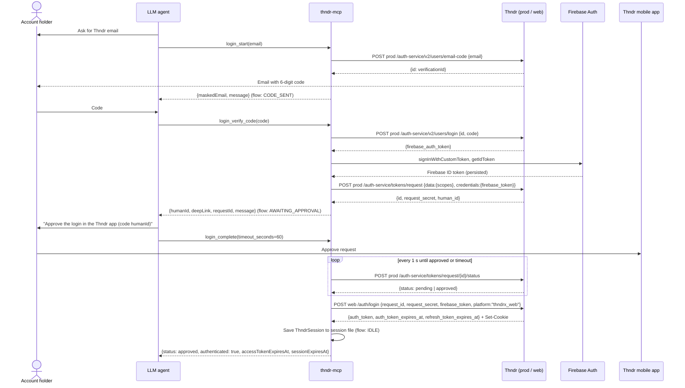

# Identity & Access use cases

Code: `src/application/identity/login.ts`, `session-token-provider.ts`; tools in
`src/interface/mcp/identity-tools.ts`. Domain: [domains/identity-and-access.md](../domains/identity-and-access.md).
API: [api/auth.md](../api/auth.md).

**Actor** for every use case: the LLM agent acting on behalf of the Thndr account holder. The account holder must
take part (read the emailed code, approve on the phone).

Hosts: `prod` = `https://prod.thndr.app`, `web` = `https://x.thndr.app/api`.

## Full login sequence

---

## Check session status — `auth_status` (`GetAuthStatus`)

- **Goal:** know whether the server is logged in and which login step is pending.
- **Preconditions:** none.
- **Input:** none.
- **Main flow:**
  1. Load the stored session and (in parallel) the Firebase ID token; a Firebase failure counts as "not identified".
  2. Read the current login-flow stage.
  3. Report.
- **Alternative/error flows:** none expected (this is the tool to call after `NOT_AUTHENTICATED` / `SESSION_EXPIRED`).
- **Output:** `authenticated` (session exists and refresh credential not expired), `identified` (Firebase ID token
  available), `pendingStep` (`none` | `verify_code` | `approve_on_phone`), `accessTokenExpiresAt`,
  `sessionExpiresAt`, `sessionEstablishedAt` (ISO strings or null).
- **Thndr endpoints:** none.

## Start login — `login_start` (`StartLogin`)

- **Goal:** have Thndr email a one-time code (step 1 of 3).
- **Preconditions:** the user has a Thndr account with that email.
- **Input:** `email`.
- **Main flow:**
  1. Validate and normalise the email.
  2. Request the code; receive a verification id.
  3. Move the login flow to `CODE_SENT` (overwrites any previous flow).
- **Alternative/error flows:**
  - Invalid email → `VALIDATION_ERROR`.
  - Thndr error or missing verification id → `UPSTREAM_ERROR`.
- **Output:** `maskedEmail` (`a***@example.com`), `message` (next step: `login_verify_code`).
- **Thndr endpoints:** `POST prod /auth-service/v2/users/email-code`.

## Verify the code — `login_verify_code` (`VerifyLoginCode`)

- **Goal:** prove the email, establish the Firebase identity and create the phone approval (step 2 of 3).
- **Preconditions:** flow is `CODE_SENT`.
- **Input:** `code` (whitespace is stripped; 4–8 digits).
- **Main flow:**
  1. Validate the code format.
  2. Verify it with Thndr; receive a Firebase custom token.
  3. Sign in to Firebase with it (identity is persisted).
  4. Continue with [Request phone approval](#request-phone-approval--login_request_approval-requestdeviceapproval).
- **Alternative/error flows:**
  - Empty or malformed code → `VALIDATION_ERROR`.
  - No code requested → `LOGIN_NOT_STARTED`.
  - Wrong/expired code or missing token → `UPSTREAM_ERROR`.
- **Output:** `humanId`, `requestId`, `deepLink` (`thndr://goToRoute?routeName=HUMAN_ID&…`), `message` to relay
  to the user.
- **Thndr endpoints:** `POST prod /auth-service/v2/users/login`, Firebase `signInWithCustomToken`,
  `POST prod /auth-service/tokens/request`.

## Request phone approval — `login_request_approval` (`RequestDeviceApproval`)

- **Goal:** create a new device approval without an email code (re-approval after `SESSION_EXPIRED`).
- **Preconditions:** a Firebase identity exists (from an earlier `login_verify_code`).
- **Input:** none.
- **Main flow:**
  1. Get the Firebase ID token.
  2. Create a token request with ThndrX's scope list.
  3. Move the flow to `AWAITING_APPROVAL`.
- **Alternative/error flows:**
  - No Firebase identity → `NOT_AUTHENTICATED` ("call login_start").
  - Thndr error or missing `id`/`request_secret` → `UPSTREAM_ERROR`.
- **Output:** same as `login_verify_code`.
- **Thndr endpoints:** `POST prod /auth-service/tokens/request`.

## Complete login — `login_complete` (`CompleteLogin`)

- **Goal:** wait for the phone approval and store the session (step 3 of 3).
- **Preconditions:** flow is `AWAITING_APPROVAL`; user has the Thndr app logged in on their phone.
- **Input:** `timeout_seconds` (0–300, default 60).
- **Main flow:**
  1. Get the Firebase ID token.
  2. Poll the request status every second until it is no longer `pending`/`unknown`.
  3. On `approved`, exchange the request for a full-access token and refresh cookie(s).
  4. Build a `ThndrSession`, save it, reset the flow to `IDLE`.
- **Alternative/error flows:**
  - No pending approval → `NO_PENDING_APPROVAL`.
  - Firebase identity lost → `NOT_AUTHENTICATED`.
  - Timeout while still pending → success response with `authenticated: false`, `status: pending`; flow kept, call
    again after the user approves.
  - `rejected` or `expired` → `authenticated: false` with that status; flow reset; use `login_request_approval`.
  - `claimed` (already used) → `UPSTREAM_ERROR`; flow reset.
  - Exchange sets no cookie, or other Thndr error → `UPSTREAM_ERROR`.
- **Output:** `status`, `authenticated`, `message`, and on success `accessTokenExpiresAt`, `sessionExpiresAt`.
- **Thndr endpoints:** `POST prod /auth-service/tokens/request/{id}/status`, `POST web /auth/login`.

## Import a browser session — `login_import_session` (`ImportSession`)

- **Goal:** log in when the account uses Google/Apple sign-in (no email OTP possible headlessly).
- **Preconditions:** the user is logged in at `https://x.thndr.app` in a browser.
- **Input:** `cookie_header` — the `Cookie` request header of any `x.thndr.app/api` request.
- **Main flow:**
  1. Parse the header into a refresh credential.
  2. Refresh once with it to obtain a full-access token (and any rotated cookies).
  3. Merge cookies, save the session.
- **Alternative/error flows:**
  - Empty header or no `name=value` pairs → `VALIDATION_ERROR`.
  - Cookies rejected (`INVALID/MISSING/EXPIRED_REFRESH_TOKEN` or 401) → `SESSION_EXPIRED`.
  - Other Thndr error → `UPSTREAM_ERROR`.
- **Output:** `authenticated: true`, `accessTokenExpiresAt`.
- **Thndr endpoints:** `POST web /auth/refresh`.

## Log out — `logout` (`Logout`)

- **Goal:** end the session and delete stored tokens.
- **Preconditions:** none (idempotent).
- **Input:** `forget_identity` (default `false`; `true` also signs out of Firebase, so the next login needs an
  email code).
- **Main flow:**
  1. If a session exists, call Thndr logout (best effort; failures ignored) and clear the session file.
  2. Optionally sign out of Firebase.
  3. Reset the login flow.
- **Alternative/error flows:** none surfaced for the remote call.
- **Output:** `loggedOut: true`.
- **Thndr endpoints:** `DELETE web /auth/logout`.

## Supply an access token (internal) — `SessionTokenProvider`

Not a tool: used by every authenticated Thndr call (`AccessTokenProvider` port).

1. No session → `NOT_AUTHENTICATED`.
2. Cached token `VALID` → use it.
3. `ABOUT_TO_EXPIRE` (≤ 180 s left) → use it and refresh in the background.
4. Otherwise refresh (single-flighted) via `POST web /auth/refresh`, merge rotated cookies, save, use the new token.
5. Refresh credential expired or rejected → clear the session, `SESSION_EXPIRED`; the agent should call
   `login_request_approval` then `login_complete`.
6. On 401/403 the HTTP client invalidates the token and retries once; a second 401 → `NOT_AUTHENTICATED`.
